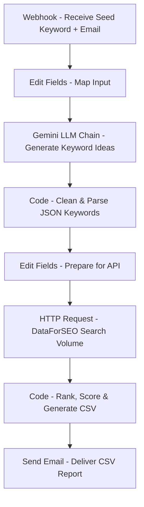

# 📊 SEO Keyword Research Workflow (n8n)

This workflow automates **SEO keyword research** using:

- **Google Gemini (PaLM)** for keyword idea generation
- **DataForSEO API** for search volume and competition metrics
- A **custom ranking algorithm** to score and select the **top 50 keywords**
- **Email delivery** of results as a CSV attachment

---

## 📌 Features

- Accepts a **seed keyword** and recipient email via webhook
- Expands the seed into multiple related keyword ideas using Google Gemini LLM
- Cleans and formats the keywords into an array
- Queries DataForSEO for **search volume, CPC, and competition index**
- Ranks keywords by a **custom formula**:
  ```
  score = (search_volume * (cpc + 0.1)) / (competition_index + 1)
  ```
  → high volume + high CPC + low competition rank higher
- Selects the **top 50 keywords**
- Converts the results into a **CSV file**
- Sends the CSV report by **email**

---

## 📂 Workflow Overview



---

## 🛠️ Setup Instructions

### Prerequisites

- Running **n8n** (Docker recommended)
- Credentials:
  - **Google Gemini API key** (configured in n8n credentials)
  - **DataForSEO API credentials** (Base64 encoded in HTTP header)
  - **SMTP credentials** (for Send Email node)

### Install

1. Import the workflow JSON into n8n.
2. Configure credentials for:
   - **Google Gemini (PaLM)**
   - **SMTP (Send Email node)**
   - **DataForSEO** → update `Authorization` header in HTTP Request node.
3. Activate the workflow.

---

## ▶️ Usage


Send a `POST` request to your n8n instance:

```bash
curl -X POST "http://<your-n8n-host>/webhook/keyword-research" \
-H "Content-Type: application/json" \
-d '{"seed": "best smartphones", "mailto": "your@email.com"}'
```

- The workflow generates related keyword ideas
- Queries DataForSEO for metrics
- Ranks keywords by score
- Sends a **CSV with the top 50 keywords** to the provided email

---

## 📊 Example CSV Output

```csv
keyword,search_volume,competition_index,cpc,score
best smartphone for photography,5400,22,1.12,275.72
affordable cell phone options,2900,15,0.85,154.26
premium smartphone vs budget device,1800,30,1.40,81.62
...
```

---

## 🔧 Ranking Algorithm Variations

Different use cases require different scoring strategies. Here are the variations you can use by modifying the **Code node**:

### 1. **SEO-focused (rank easiest to target)**

```js
score = search_volume / (competition_index + 1);
```

- Prioritizes **low competition**
- Best if your site is **new** or has **low domain authority**

### 2. **Commercial-focused (maximize monetization)**

```js
score = (search_volume * (cpc + 0.1)) / (competition_index + 1);
```

- Balances **traffic + CPC value**
- Best for **affiliate, ecommerce, or paid campaign planning**

### 3. **Traffic-only focus (maximize visibility)**

```js
score = search_volume;
```

- Ignores CPC and competition
- Best if you just want **high traffic blog topics**

### 4. **Balanced score (traffic + difficulty tradeoff)**

```js
score = (Math.log(search_volume + 1) * (cpc + 1)) / (competition_index + 1);
```

- Penalizes very high difficulty more strongly
- Useful if you want **steady traffic growth with realistic targets**

---

## 📈 Future Enhancements

- Add **SERP analysis** using SerpApi or custom scraper
- Keyword **clustering** for topic groups
- Integrate with **Google Sheets** instead of email
- Schedule automatic daily/weekly runs

---

## 🚨 Troubleshooting

- **Email not attaching CSV** → Ensure `attachments = data` in Send Email node matches the binary property from Function node.
- **Unexpected socket close** → Check SMTP port/SSL settings (465 = SSL/TLS, 587 = STARTTLS).
- **Gemini output parse errors** → Verify it returns valid JSON (use prompt to enforce JSON array output).

